# mh3u-companion

[](https://github.com/glinesbdev/mh3u-companion/actions/workflows/ci.yml)

A terminal app for Monster Hunter 3 Ultimate (Wii U, played in Cemu). It reads your save file and your own game dump to show
what you own and what you need to craft or upgrade gear.

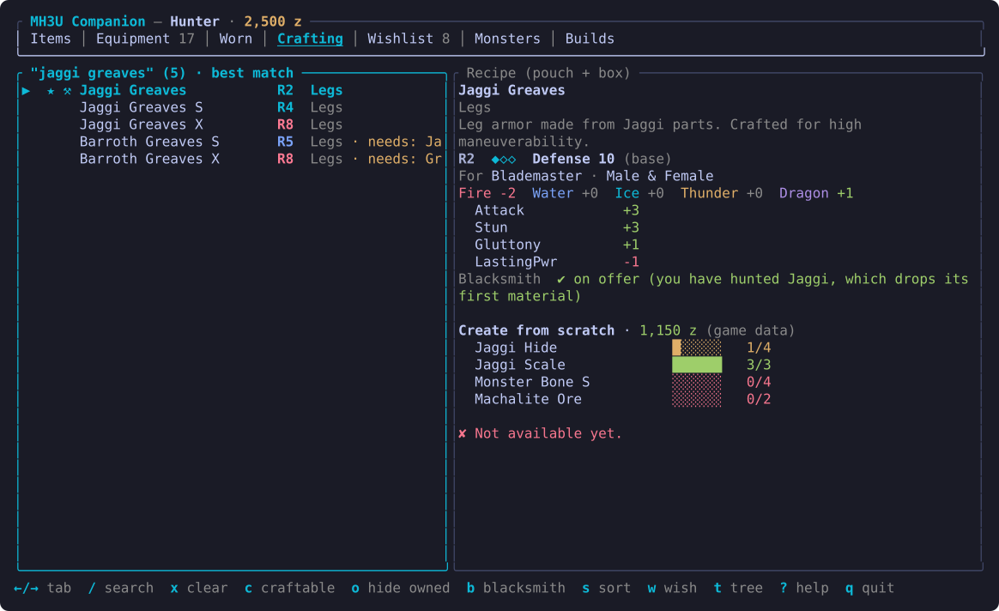

<details>
<summary>More screenshots</summary>

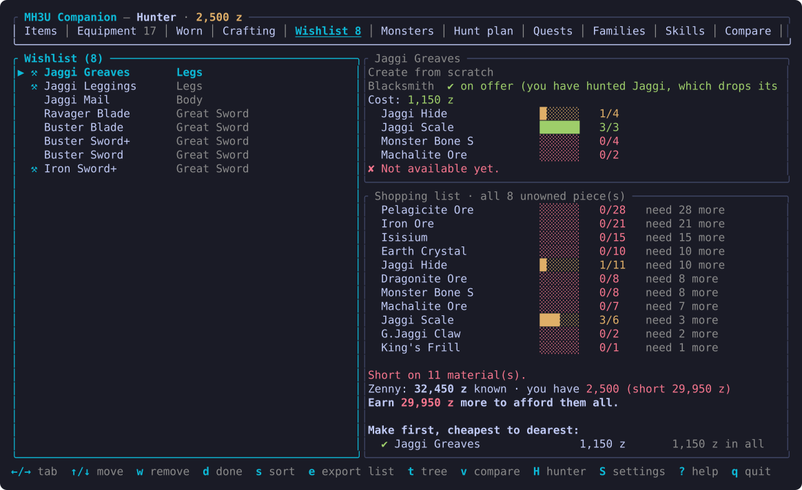

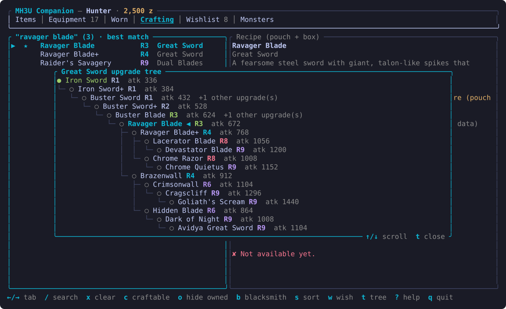

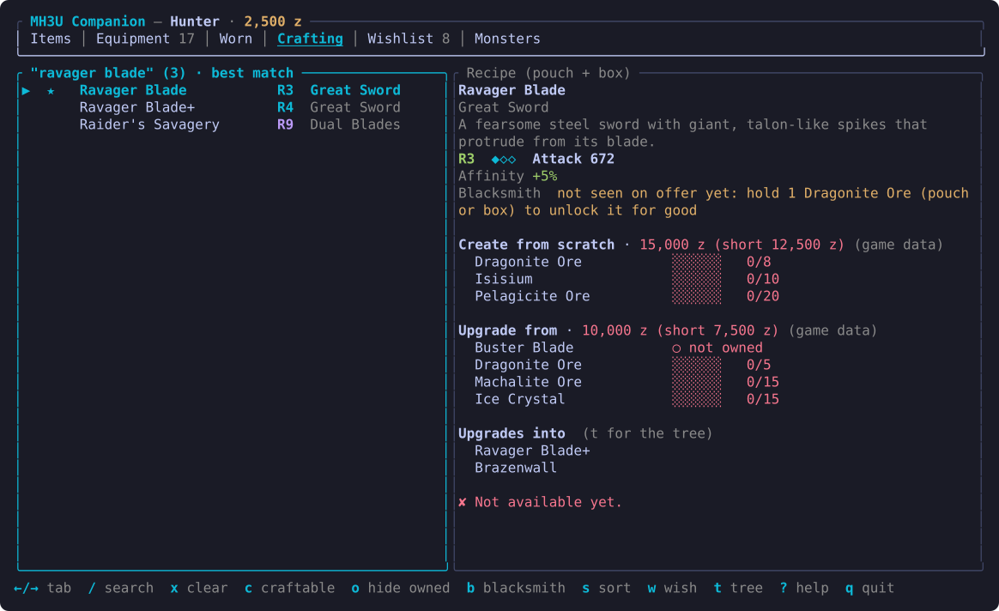

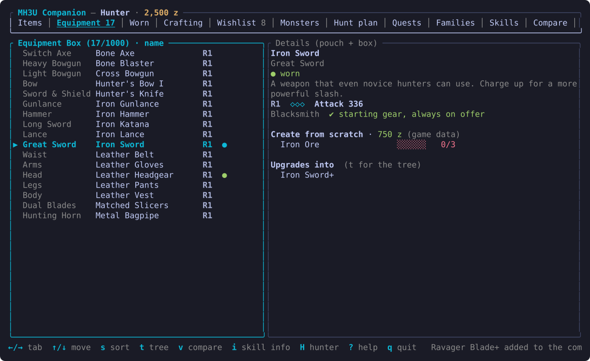

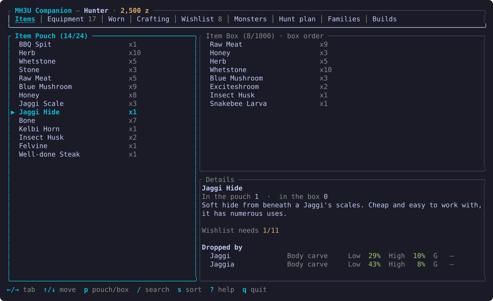

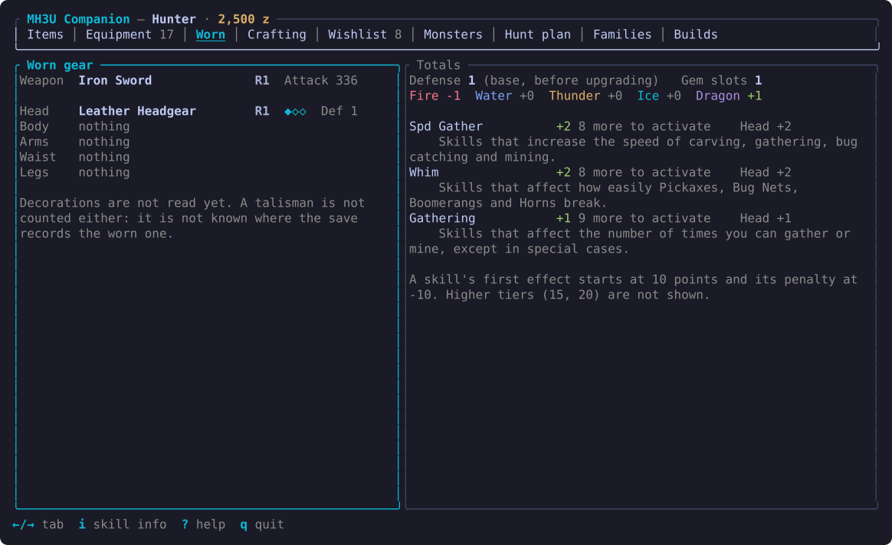

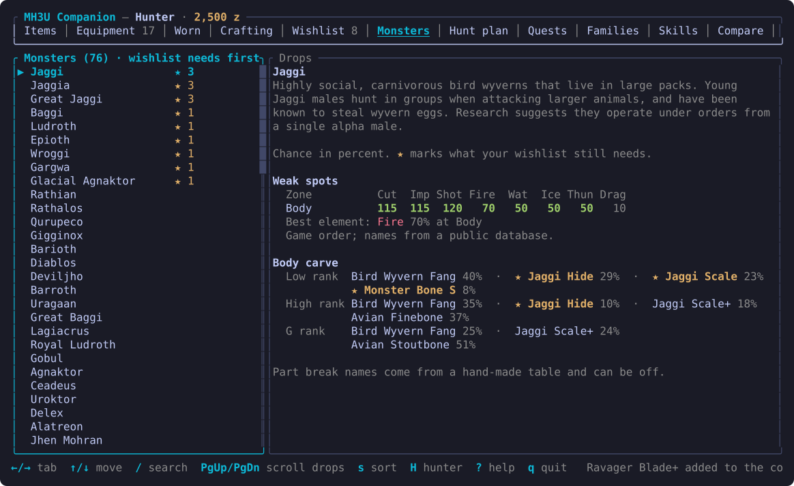

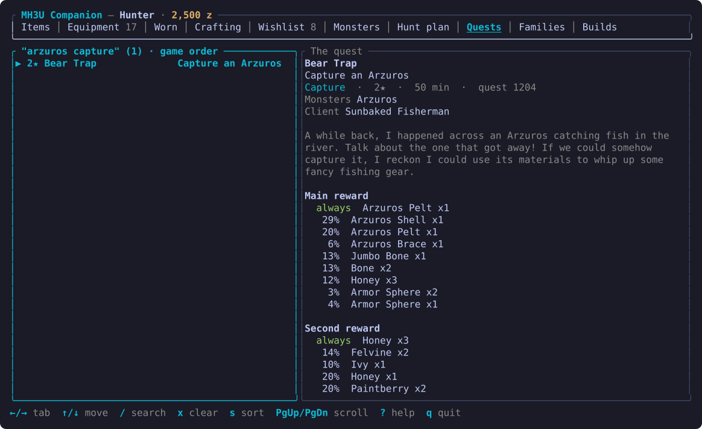

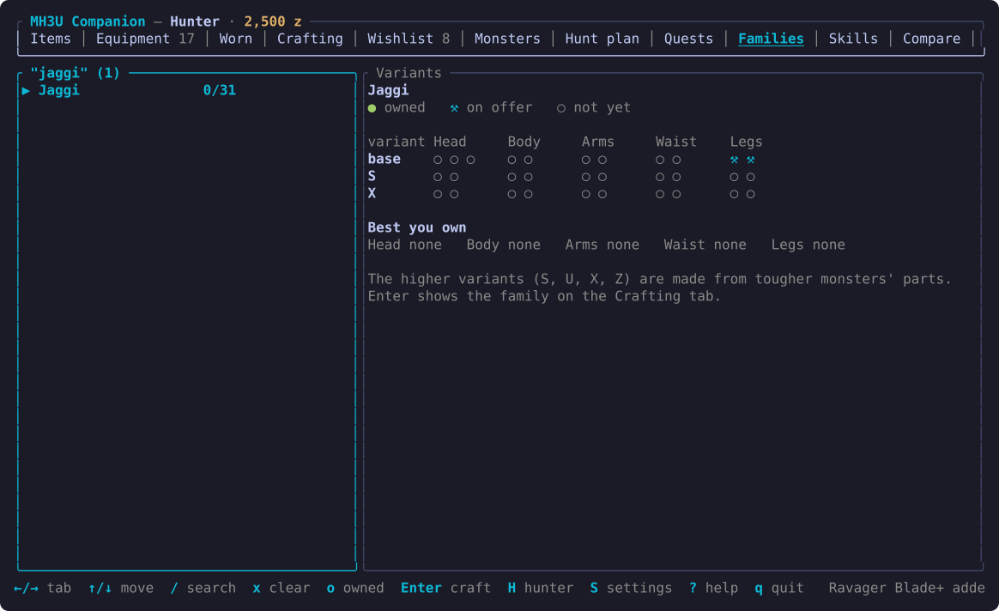

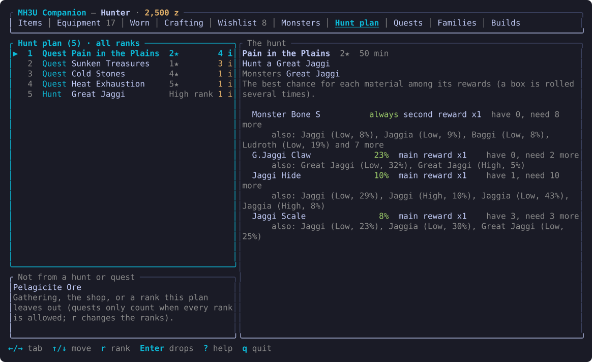

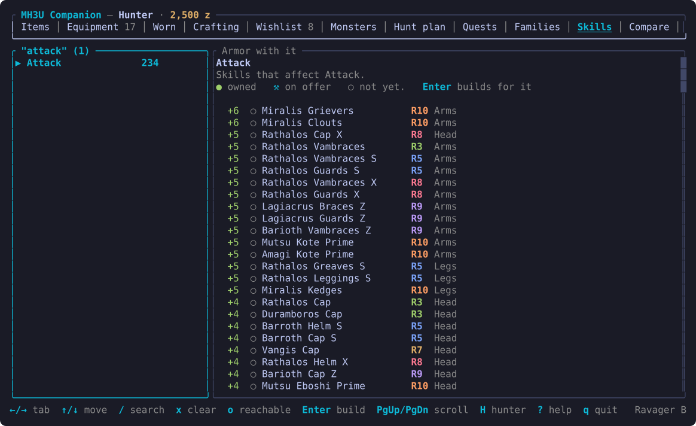

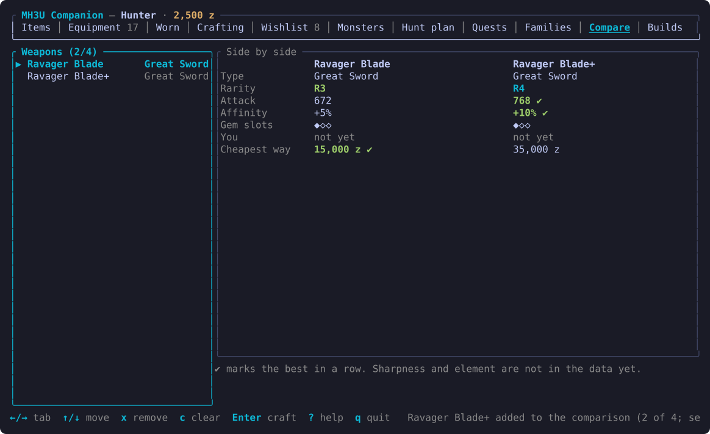

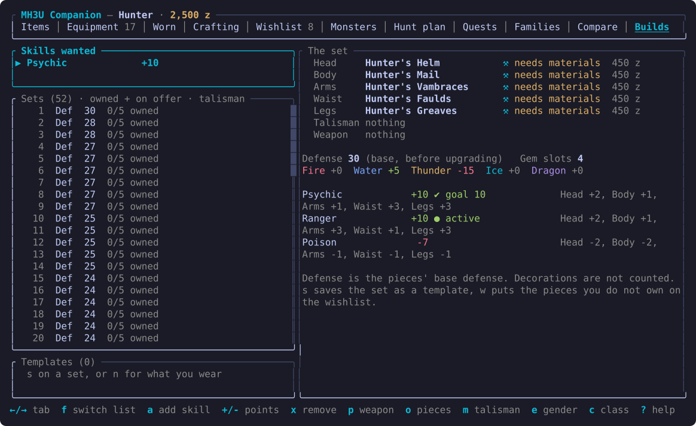

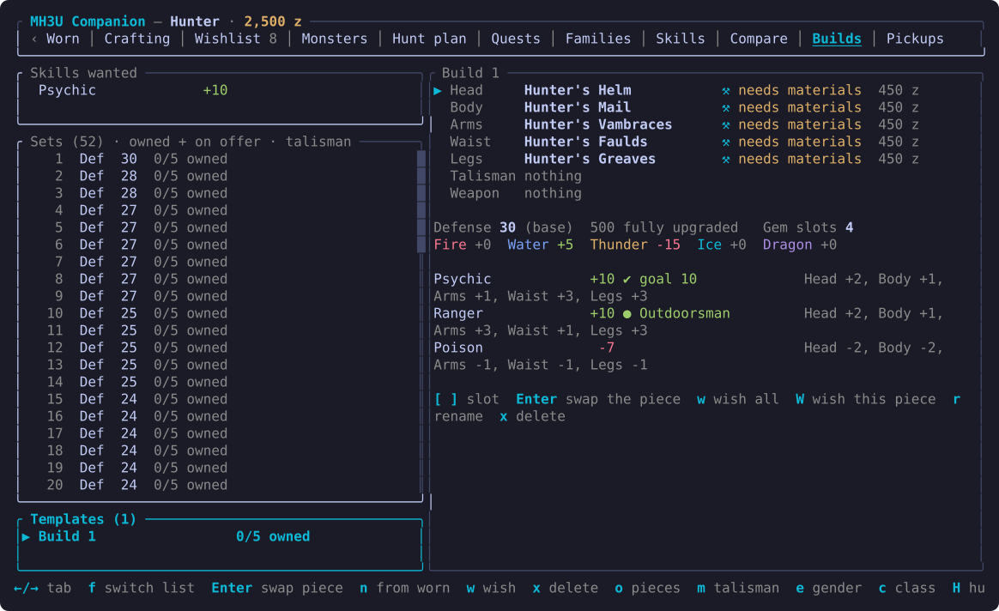

</details>

The pictures are drawn from the app's own output by `scripts/screenshots.sh` (the hunter name is replaced), using the colors of a
dark theme; your terminal's own palette applies when you run it.

## What it does

- **Items**: item pouch and item box, with names and quantities, and a details panel for the highlighted item: the game's description, how many you hold, what the wishlist needs of it, which armor and weapons are made with it, and which monsters drop it. The header shows your hunter name and zenny. `/` is a fuzzy
  search by item name over both lists (typos are fine: `hny` finds Honey).
- **Monsters**: every monster with drop data, and what it drops when carved, by rank (low, high, G): body carve, tail carve, shiny drops, capture rewards and part-break rewards, with the chance of each item. A ★ marks items your wishlist still needs, and `s` can put the monsters that drop the most of them first. The Items tab shows the same thing from the other side: the highlighted item's "Dropped by" list. `p` on the Items tab moves the highlight between the pouch and the box.  Part breaks are named ("Head break", "Wing break") for the 43 monsters a small hand-made table covers (made by matching the lists against a published monster database, so a name can be off); the others are numbered in the game's order. PageUp/PageDown scroll the drops. The same pane lists the monster's **weak spots**: damage percentages (cut, impact, shot and the five elements) for each hit zone, soft ones in green, and the best element. Zones are numbered in the game's order, as its data names none. Which monster a capture or break list belongs to is inferred (see `docs/formats.md`).
- **Worn**: what you are wearing, slot by slot, and what it adds up to: base defense (and the defense fully upgraded), gem slots, resistances and the skill points of each skill with where they come from. A skill is active at 10 points or more and has its penalty at -10 or less (every skill's first effect starts at 10); Torso Up, when active, doubles the body piece's points. The talisman and decorations are not read yet. The higher tiers (15 and 20 points) and which effect each tier gives are not decoded, so they are not shown.
- **Descriptions**: the details panels show the game's own description of the piece. `i` also shows what each skill does under it.
- **Equipment**: your equipment box, with the same details panel as the Crafting tab (stats, recipes and costs, and what a weapon upgrades into). The weapon and armor you are wearing are marked `●`. `s` cycles the sort: box order, name, rarity, type, worn first.
- **Crafting**: every armor piece and weapon that has a recipe, with have/need counts for each material (pouch and box together).
  - Armor shows rarity, gem slots, base defense, resistances and skills.
  - Weapons show rarity, gem slots, attack and affinity (read from the game files), a "Create from scratch" recipe and an "Upgrade from" recipe, and whether you own the parent weapon.
  - `/` is a fuzzy search over name, type, armor skill, materials, and the labels `male` / `female` / `blademaster` / `gunner`
    (a piece for both genders or both classes matches both). A number from 1 to 10 (or `r3`) filters by rarity, so `attack 3`
    finds armor with an Attack skill and rarity 3 (weapons have a rarity too, so they match as well).
    Several words must all match: `psychic head`, `female gunner 5`. Typos are tolerated (`rthlos mail` finds Rathalos Mail).
    Matches that aren't by name show why (`skill: Poison`, `needs: Iron Ore`). With a search active the list is ordered best
    match first: matches on a name, type or skill come first (grouped by slot), then the weaker ones (loose fuzzy matches, or
    pieces that merely need a material with that name), also grouped. `x` or `Esc` clears the search.
  - Armor details show rarity, slots, base defense, gender (Male / Female / Both) and type (Blademaster / Gunner / Both).
  - `c` shows only what you can make now. `o` hides pieces you already own. `b` shows only what the blacksmith is offering (see below), and an anvil marks those pieces in the list. `s` cycles the sort: game order, name, craftable
    first, owned first. Like pieces always stay together in the order head, body, arms, waist, legs, talisman, then the weapon
    types; the sort orders them within each group. (Craftable first and owned first split the list by that flag, then group.)
- **Blacksmith unlock**: the details panel says whether the blacksmith offers a piece. The save keeps a count of how many times each monster has been killed or captured, and a piece is on offer once a monster that drops the first material of its recipe has been hunted at least once; holding the material without the hunt does not count. Starting gear is always on offer, and Yukumo-style special pieces follow some other rule. The high-rank sets (S, X...) use materials that drop only in high or G rank, so the app says they need a hunt in that rank (high rank is 6★+ quests when playing alone; G rank opens after the Hunter Rank 5 urgent quest "Throne of the Abyss"). The game's count is not kept per rank, so the app cannot tell whether that hunt has happened. The game never takes a piece off the list, so the app remembers every piece it has seen on offer (per hunter, in `unlocked.tsv` next to the price ledger). The rule matches what was seen in play on one test hunter (Jaggi, Ludroth, Bone and Arzuros pieces, the Jawblade) and an early save of another; pieces whose first material is not a monster drop (ores, bugs, fish) are marked as unknown.
- **Wishlist**: press `w` on a piece in the Crafting tab to add it (marked ★). A weapon is planned by its cheapest way (see
  "Cheapest way to a weapon" below): if that is a chain of upgrades, the weapons in the chain that you do not own are added with it,
  first to last, so the list holds every step. Armor never has parents. Removing a piece also removes the parents that were added
  automatically for it, unless another wishlisted piece still needs them; parents you added yourself are kept. The Wishlist tab lists your pieces, with an anvil on those the blacksmith is offering that you don't own yet. On the right,
  the highlighted piece shows what it needs by itself (have / need), and below it is one running shopping list for everything
  on the wishlist (have / need / still missing). Pieces you already own are left out of the totals. For each
  piece it plans the step the cheapest way to it ends with: making it, or upgrading it from the weapon before it (which uses
  that weapon up, whether you own it or it is the previous step). Each save slot has its own wishlist (`--slot n`), saved in
  `~/.config/mh3u-companion/` (or under `$XDG_CONFIG_HOME`): `wishlist.txt` for slot 1, `wishlist-2.txt` and `wishlist-3.txt` for the others.
- **Upgrade tree**: `t` on a weapon (in Crafting, Equipment or Wishlist) opens its tree: the line of weapons from the first one down to it, a note where other branches leave that line, and everything it can be upgraded into, each marked owned or not with rarity and attack. `↑`/`↓` scroll, `t` or `Esc` close. Armor has no upgrade line in the game data, so it has no tree.
- **Zenny plan** (Wishlist tab, under the shopping list): how much more zenny the wishlist's forging fees take than you have ("Earn 29,950 z more to afford them all"), then the pieces to make first: the cheapest to the dearest, with a ✔ while the zenny you have pays for that piece and every cheaper one above it, the running total, and "materials ready" on those you can make now.
- **Affordable now** (Crafting tab): each row shows its forging fee (green when you can pay it), `z` shows only pieces you do not own whose fee you can pay, and the last sort (`s`) is cheapest first.
- **Skills**: pick a skill (`/` searches) and see every armor piece that has it, the most points first, each marked owned, on offer or not yet; `o` limits it to pieces you own or the blacksmith offers, and Enter adds the skill to the Builds tab (10 points).
- **Hunter picker**: `H` lists the save slots that hold a hunter, with the play time and the village and guild quests done on each guild card, and shows the one you pick: their save and their wishlist, skills and templates. With `--live` the game picks the hunter (see Live mode), so the list is off while connected.
- **Cheapest way to a weapon**: for a weapon you do not own, the details panel shows the cheapest route by forging fees from what is in your equipment box: each step (make, or upgrade from the weapon before it) with its fee, and the materials for all of them added up. A weapon you own is where a route starts and costs nothing; a weapon with two parents takes the cheaper way in. It is shown when the route is longer than just making the weapon, with the price of making it from scratch beside it. Fees are the forging fees only (materials have no price).
- **Spare items**: on the Items tab each item shows how many can go, and `u` shows only those with something spare. You keep what the wishlist's shopping list needs and enough for the most any one piece you do not own takes; the rest is spare. An item no recipe uses, or only pieces you already own use, is all spare. The details say why. The game's sell prices are not known, so it shows counts, not zenny.
- **Hunt plan**: for the materials your wishlist is still short of, which monsters to hunt and which quests to do. The first step is the one that gives the most of them, the next picks up what it left, and so on. A hunt shows, for each material, the way that gives it in the fewest runs and how it drops (carve, capture, part break...); a quest shows the same among its rewards (and whether it is the main or the second box). Each material and step also shows about how many runs it takes (the number missing over what one run gives on average: 3 carves, 1 tail carve, 2 capture rolls and 1 roll per break for a monster, 3 rolls of the main box and 1 of the second for a quest; these counts are assumptions, not read from the game), and the title adds them up. When two hunts cover the same number of materials, the one that needs fewer runs comes first. Each material also lists the other monsters that give it. `r` limits the plan to low, high or G rank (a quest counts for its own rank: village quests of 1 to 5 stars and hall quests of 1 and 2 stars are low rank, village quests of 6 to 9 stars and hall quests of 3 to 5 stars high rank, hall quests of 6 to 8 stars G rank; tutorials and event quests have no rank and are only used with every rank allowed) and Enter jumps to the monster's full drops on the Monsters tab, or to the quest on the Quests tab. Materials nothing gives (ores in a rank you left out, bugs, fish) are listed apart. It is called a hunt plan, not farming, because the game has a farm of its own.
- **Quests**: every quest in the game (read from the quest files of your dump): its title, goal, client, stars, time limit, the large monsters and both reward boxes with the chance of each item (an item marked "always" is given every time). `/` searches by name, goal, monster or reward item (`arzuros capture`, `rathian shell`), `s` sorts by game order, name, stars or the quests that give the most of what your wishlist is short of, and `★ 3` on a row means the quest can give three of those items. `m` shows the quest's monster on the Monsters tab, with a short list to choose from when a quest has several. Each quest says whether it is a village or a hall quest (read from its id), and shows its zenny reward and fee, the hunter rank points of a hall quest, the map and the two small monsters. Not shown: day or night, and the maps of the last two Elder Dragon quests.
- **Families**: armor grouped by the family in its name (Agnaktor, Zinogre...), since the game has no table of sets. For the highlighted family a table shows each variant (the base set and the S, U, X and Z versions made from tougher monsters' parts) against head, body, arms, waist and legs, with a mark for every piece: owned, on offer at the blacksmith, or not yet. Below it, the best variant of each slot you own. `/` searches, `o` shows only families you own something of, and Enter looks the family up on the Crafting tab.
- **Compare**: `v` on a weapon in the Crafting, Equipment or Wishlist tab puts it in the comparison (again to take it out), up to four. The Compare tab shows them side by side: type, rarity, attack, affinity, gem slots, whether you own it or the blacksmith offers it, and the fees of the cheapest way to get it, with the best of each row marked ✔ (attack is only compared between weapons of one type, since each type scales attack in its own way). `x` takes the highlighted weapon out, `c` clears, Enter looks it up in Crafting. Sharpness and element are not decoded. The comparison is kept until the app closes.
- **Pickups** (live mode): the items you gained while playing, newest first, with the zenny change over the same time. Changes within 20 seconds make one entry, so a quest's rewards show as a block (the game does not say when a quest ends). Moving items between the pouch and the box is not a pickup. ★ marks what the wishlist was short of, and the status line announces a pickup as it lands, and also when a wishlisted piece becomes craftable. The log is kept per hunter in `gains.tsv` (`gains-2.tsv`, `gains-3.tsv`) in the data folder.
- **Builds**: pick the skills you want (`a`, then type part of the name) and how many points (`+`/`-`, 10 is where a skill's first effect starts) and the app lists the head, body, arms, waist and legs pieces, plus one of your talismans, that reach them, sturdiest first. `o` chooses which pieces it looks at: only the armor you own, plus what the blacksmith is offering (the default), or every piece in the game, to plan ahead for gear you cannot get yet (those show as not on offer yet); `m` turns the talisman on and off, `p` picks the weapon the set is for (its type picks the armor class, since bows and bowguns take gunner armor, and it is saved with a template and its missing pieces go to the wishlist with the rest), `e` limits the pieces to those a male or female hunter can wear and `c` to blademaster or gunner armor (pieces for both always pass). The details show each piece (owned, or whether you can make it now and what it costs) and the totals as on the Worn tab, with each wanted skill marked reached or not. `w` puts the pieces you do not own on the wishlist.
- **Build templates**: `s` on a found set saves it under a name, and `n` (in the templates list, reached with `f`) saves the armor you are wearing. A template is a full set you keep and can change: `[` and `]` pick a slot (head, body, arms, waist, legs, talisman and weapon), Enter opens a list of every piece for it (owned first, then what the blacksmith offers, then the rest; type to find one, or empty the slot) and the totals update as you swap. `w` puts all the pieces you do not own on the wishlist and `W` only the highlighted slot's; `r` renames and `x` deletes. Templates remember a piece by its kind and id, a talisman by its skills.
- **Per hunter**: the wanted skills, the options and the templates are kept per save slot beside the wishlist: `builds.txt` and `templates.txt` for slot 1, `builds-2.txt`, `templates-2.txt` and so on for the others. Not counted yet: decorations and skill levels above the first (10 points).
- **Look**: green means you have it or can afford it, yellow partly, red missing, cyan marks focus and keys. Materials show a
  small bar (`███░░░ 3/5`), armor shows its rarity (`R5`), gem slots (`◆◆◇`), element-colored resistances and one skill per
  line, and a forging cost turns red with the shortfall when you can't pay it. The terminal's own color scheme is used; set
  `NO_COLOR=1` for plain text. The anvil is a Nerd Font glyph (Unicode has no anvil); `MH3U_ICONS=plain` draws a hammer and pick instead for terminals without a Nerd Font. Below 100 columns the panes stack instead of sitting side by side.
- **Sorting**: `s` on the Items tab sorts the item box by box order, name or quantity.
- `Home`/`End` (or `g`/`G`) jump to the top and bottom of a list. `?` shows a key reference.
- The screen reloads on its own whenever the game writes the save.

Not shown yet: sharpness and element for weapons. See `docs/formats.md`.

## Live mode

`mh3u-tui --live` starts Cemu itself and shows the game's data as it changes, before you save: move an item and the screen
follows. Close any running Cemu first, then run the TUI and load your hunter in the game window. The header shows
`● live` once connected, and the app switches to the hunter the game loaded: their wishlist, skills and templates (the files of that save slot) replace the ones on screen, so `--slot` is not needed with `--live`, and loading another hunter in the game switches again. Any change in zenny (shops, NPCs, quest rewards or fees) shows next to the total in the header
as `▲ +1,200` or `▼ -300` for 15 seconds, adding up if several happen close together, and in the status line. See `docs/live.md` for how it works and why the TUI must be the one to start Cemu.

Forging costs for weapons (create and upgrade) and armor are read straight from the game files and always shown, unless you have seen a different price in play, which then wins. In live mode, crafting a piece also teaches the app what it cost (and, for the few pieces the game data has no recipe for, what it needs): the zenny drop is matched against the piece's recipe and kept in
`~/.local/share/mh3u-companion/prices.tsv`, then shown beside the recipe and totalled on the Wishlist tab. See `docs/prices.md`.

`mh3u-tui --live --debug-edit` adds a debug command line (`:`) that changes the running game's zenny and item box (`zenny 50000`,
`give iron ore`, `stock` to cover the wishlist) for testing without hours of play. This is the only part that writes to the game;
it backs up your save slots first, and anything you then save in the game keeps the edits. See `docs/live.md`.

## Running

```
cargo run --release -p mh3u-tui
```

It looks for the game dump under `~/games/wiiu/` (a folder whose name contains `[Game] [0005000010118300]`) and the save at
`~/.local/share/Cemu/mlc01/usr/save/00050000/10118300/user/80000001/user1`. Override either:

```
mh3u-tui --game-dir "/path/to/MONSTER HUNTER 3 ULTIMATE [Game] [0005000010118300]" --save /path/to/user1
```

or set `MH3U_GAME_DIR` and `MH3U_SAVE` (`--help` lists the options). The game has three save slots (`user1`, `user2`, `user3`); `--slot 2` picks the second
one in the default Cemu folder. Press `?` in the app for the keys.

The game data is read from **your own dump** at runtime. No game data is stored in this repository.

Tested only with the US version (update v32) of the game. The recipe and stats tables are located by fixed offsets in the game
executable, which are checked on load; a different version will fail with an "unsupported executable" error instead of showing
wrong data.

## Layout

- `crates/mh3u-core`: parsers (save, `.arc` archives, `.gmd` text, `.rpx` executable, recipes, armor and weapon stats, drops) and `GameData`.
- `crates/mh3u-app`: the app without a screen: its state and what it does with keys and time (`app/`, one file per feature), and the logic behind it (build search, hunt plan, cheapest route, templates, the files it keeps).
- `crates/mh3u-tui`: the terminal screen for it (`ui/` the drawing, `keymap.rs` the keys, `theme.rs` the colours).
- `crates/mh3u-tools`: developer commands used to reverse-engineer the formats: `savediff`, `items`, `recipe`, `arcls`, `arcx`,
  `gmd`, `arcsearch`, `prices-add`, `prices-hint`, `armor-todo`, `weapon-names`, `unlock-guess`, `unlock-monsters`, `drops`, `ansi2svg`, `cemu-host` (starts Cemu and answers memory queries from a file; used to find where the data lives).
- `scripts/check.sh`: the checks CI runs (format, clippy, tests); run it before every commit.
- `scripts/screenshots.sh`: regenerates `docs/screenshots/*.svg` by running the app in tmux in a sandbox (needs a save and the release build; `mh3u-tools ansi2svg` draws the pictures).
- `docs/architecture.md`: how the code is organised and how to add a tab.
- `docs/code-guidelines.md`: how to change it without letting it get tangled (rules, limits, tests, the checklist for a feature).
- `docs/ideas.md`: ideas for the app, with what each one needs.
- `docs/formats.md`: what is known about each file format, and how confident that knowledge is.
- `docs/live.md`: how live mode finds and reads the game's data.
- `docs/prices.md`: the forging-cost ledger and the search for where the game stores prices.
- `snapshots/`: copies of save files taken during development. These are personal save data and are git-ignored; some tests read them and are skipped when they're missing.

## Development

```
scripts/check.sh   # cargo fmt --check, clippy -D warnings, cargo test: the same three CI runs
```
 See `docs/code-guidelines.md` before changing the code.

## License

Public domain under the [Unlicense](LICENSE): use it however you like, no attribution needed. This covers the code and docs only.

Monster Hunter 3 Ultimate and all of its content (items, recipes, text, artwork) are the property of Capcom, who hold all rights to it. This is an unofficial fan tool, not affiliated with or endorsed by Capcom, Nintendo or Cemu. It reads data from your own copy of the game and includes none of it.
