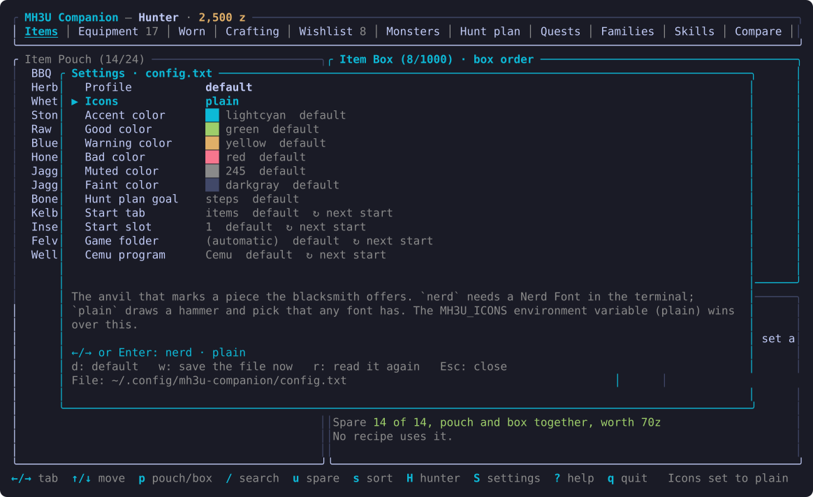

# mh3u-companion

[](https://github.com/glinesbdev/mh3u-companion/actions/workflows/ci.yml)

A terminal app for Monster Hunter 3 Ultimate (Wii U, played in Cemu). It reads your save file and your own game dump to show
what you own and what you need to craft or upgrade gear. **Linux only for now** (see [Platform](#platform)).


<details>
<summary>More screenshots</summary>




</details>

The pictures are drawn from the app's own output by `scripts/screenshots.sh` (the hunter name is replaced), using the colors of a
dark theme; your terminal's own palette applies when you run it.

## Platform

Linux only, for now. It has only been tried on:

- **OS:** Omarchy (an Arch Linux based distribution), kernel 7.2
- **Terminal:** [Foot](https://codeberg.org/dnkl/foot) 1.28. Other terminals with true color and Unicode should work, but have not been tried; a
  Nerd Font is needed for the anvil icon unless `icons = plain` is set (see Settings).
- **Emulator:** Cemu 2.6 for Linux, with the US version of the game (title id 0005000010118300)
- **Rust:** 1.99 (the 2024 edition)

Live mode (`--live`) reads Cemu's memory through `/proc`, so it cannot work anywhere but Linux. Reading a save file and a game dump needs
nothing Linux specific and may well work on other systems, but that has not been tried, and the default folders (Cemu's `~/.local/share/Cemu`
and the settings in `~/.config`) are the Linux ones. Reports from other systems and terminals are welcome.

## What it does

Tabs, left to right. `?` shows every key; `/` searches, `s` sorts, `Enter` follows a row to the tab that explains it. The full notes on each
tab are in [`docs/features.md`](docs/features.md).

**What you have**
- **Items**: pouch and box with a details panel: the game's description, sell and shop price, carry limit, what the wishlist still needs, the
  pieces made with it, the monsters that drop it and where to gather it. `/` is a typo-tolerant search (`hny` finds Honey); `u` shows
  only what is spare (more than the wishlist and any piece you do not own will use), with what it would sell for.
- **Equipment**: your equipment box with the Crafting tab's details panel; worn gear is marked `●`. Sorts include attack, defense, worn first
  and skill points.
- **Worn**: the worn gear slot by slot and what it adds up to: defense (and fully upgraded), gem slots, resistances and skill points with
  where they come from. Talismans and jewels count; Torso Up doubles the body piece. Each skill shows the effect its points give, higher tiers
  included (`i` says what it does). A weapon's hidden element shows once the Awaken skill is reached.

**What to make**
- **Crafting**: every armor piece and weapon with a recipe, with have/need counts. The details show stats, the "create" and "upgrade"
  recipes, the cheapest route to a weapon you do not own, and whether the blacksmith offers it. `/` searches name, type, skill and
  materials (`female gunner 5`, `psychic head`); `c` craftable now, `z` affordable now, `o` hide owned, `b` on offer.
- **Blacksmith**: a piece is on offer once a monster that drops the first material of its recipe has been hunted (the game's count is not per
  rank, so high-rank sets are marked as needing a hunt). The program remembers every piece it has seen on offer, per hunter.
- **Wishlist**: `w` on a piece adds it, with the parent weapons it needs. A shopping list totals what is missing, a zenny plan says what to
  earn and make first, `d` marks a piece done, `s` sorts, `e` exports the list as text. `t` opens a weapon's upgrade tree.
- **Compare**: up to four weapons side by side (`v` adds one), with sharpness, element and the fees of the cheapest way.
- **Families**: armor grouped by set name, with which variant of each slot you own. **Skills**: every piece with a skill; Enter adds it to Builds.
- **Builds**: pick skills and points (a higher tier can be asked for) and get head, body, arms, waist and legs sets (plus a talisman) that
  reach them. Filters for owned/offered/all pieces, craftable now, rarity, gender and class; rank by defense, pieces owned, gem slots or
  resistance. Choosing a weapon sets the armor class and lists the skills that suit it first. `s` saves a set as a **template** you can
  edit slot by slot; `w` puts the missing pieces on the wishlist.

**Where to get things**
- **Monsters**: drops by rank with chances (body and tail carve, shiny, capture, part breaks), the game's Hunter's Note, and weak spots by hit zone.
  ★ marks what the wishlist needs. Part breaks are named for 43 monsters from a hand-made table (a name can be off); the rest are numbered.
- **Quests**: every quest with its goal, client, map, small monsters, zenny and both reward boxes. `m` shows its monster.
- **Hunt plan**: which monsters and quests cover the materials the wishlist is short of, with an estimate of runs (the drop rolls per run are
  assumptions). `g` aims for the fewest steps or the fewest runs, `r` limits the rank (or the ranks your hunter rank has reached). Materials
  nothing drops are listed apart, with where to gather them. It is called a hunt plan, not farming, because the game has a farm of its own.

**Around the game**
- **Hunter picker** (`H`): the save slots that hold a hunter, with guild card details: rank, title, play time, quests, last quest and most used weapon.
- **Since last time**: at start the status line tells what changed since the app last closed. **Pickups** (live mode) lists items as they are gained.
- **Settings** (`S`): colors, icons, hunt plan goal, start tab and slot, game folder and Cemu program, kept in `config.txt` (see below).
- **Look and keys**: green you have it or can afford it, yellow partly, red missing, cyan marks focus and keys. `NO_COLOR=1` gives plain text; panes
  stack below 100 columns. `Home`/`End` or `g`/`G` jump in a list. The screen reloads whenever the game writes the save.

### Settings file

`S` edits `~/.config/mh3u-companion/config.txt` (under `$XDG_CONFIG_HOME` if set): one `key = value` per line, `#` comments on their own
lines. The file lists every setting with a comment, its choices, an example and its default as a commented-out line, so setting one means
removing the `#`; the screen edits only the line it changes and keeps your comments. A color is a name (`lightcyan`), a number from the
256-color palette (`245`) or `#rrggbb`. The anvil is a Nerd Font glyph; `icons = plain` (or `MH3U_ICONS=plain`) draws a hammer and pick instead.

- **Profiles**: `config.txt` is the profile `default`, `config-NAME.txt` is `NAME`. The first row of the screen switches (remembered for the
  next start) or makes a new one as a copy; `--config NAME|FILE` (or `MH3U_CONFIG`) picks one for a run. `w` saves now, `r` reads the file again.
- **Defaults**: `config/default.txt` in the repo has every setting written out at the value the program was made with, except `game_dir`
  and `cemu`, which are blank for you to fill in. Copy it to `config.txt` to start from it.
- **Precedence**: the command line (`--game-dir`, `--slot`, `--cemu`) and the environment (`MH3U_GAME_DIR`, `MH3U_ICONS`) win over the file.
  Colors, icons and the goal change at once; the start tab, slot, game folder and Cemu program at the next start. A line the program cannot
  read is reported on the status line and skipped.

### Where the data comes from

Most of it is read from your own game dump and save. Two kinds of fact are not in files the program can read, so they are tables taken from
public databases and joined to the game's own names: **Kiranico's** (weapon sharpness, elements, shells, phials and horn notes; item carry
limits and shop prices; where to gather; hit zone names; skill tiers, which effect each tier gives) and the **Monster Hunter Wiki's** (hunting
horn songs). They live in `crates/mh3u-core/data/`; a hand-made list says which skills suit which weapon. Bows and bowguns have no sharpness
or element. How each part was found, and what is a guess, is in `docs/formats.md`.

## Live mode

`mh3u-tui --live` starts Cemu itself and shows the game's data as it changes, before you save: move an item and the screen
follows. Close any running Cemu first, then run the TUI and load your hunter in the game window. The header shows
`● live` once connected, and the app switches to the hunter the game loaded: their wishlist, skills and templates (the files of that save slot) replace the ones on screen, so `--slot` is not needed with `--live`, and loading another hunter in the game switches again. Any change in zenny (shops, NPCs, quest rewards or fees) shows next to the total in the header
as `▲ +1,200` or `▼ -300` for 15 seconds, adding up if several happen close together, and in the status line. See `docs/live.md` for how it works and why the TUI must be the one to start Cemu.

Forging costs for weapons (create and upgrade) and armor are read straight from the game files and always shown, unless you have seen a different price in play, which then wins. In live mode, crafting a piece also teaches the app what it cost (and, for the few pieces the game data has no recipe for, what it needs): the zenny drop is matched against the piece's recipe and kept in
`~/.local/share/mh3u-companion/prices.tsv`, then shown beside the recipe and totalled on the Wishlist tab. See `docs/prices.md`.

A build with the `edit` feature (`cargo run -p mh3u-tui --features edit -- --live --debug-edit`) adds a debug command line (`:`) that changes the running game's zenny and item box (`zenny 50000`,
`give iron ore`, `stock` to cover the wishlist, `equip` and `talisman` to write equipment records and find out what their bytes mean) for testing without hours of play. This is the only part that writes to the game, and it is left out of a default build;
it backs up your save slots first, and anything you then save in the game keeps the edits. It is for playing alone: everything the commands change is noted per hunter, `purge` takes it all out again, and when Cemu has online play turned on or the game holds a network connection the program takes the edits out by itself and refuses new ones (`--debug-edit` will not even start while Cemu's account has online play on). That is a safeguard for honest users, not protection against someone who changes this open source program. See `docs/live.md`.

## Running

```
cargo run --release -p mh3u-tui
```

It needs to be told where your game dump is: the `game_dir` setting (press `S`, or see `config/default.txt`), `--game-dir` or
`MH3U_GAME_DIR`. That can be the dump itself (the folder with `content/`) or a folder that holds dumps, in which case the one whose name
contains `[Game] [0005000010118300]` is used; a leading `~` is your home folder. The save is read from Cemu's own folder
(`~/.local/share/Cemu/mlc01/usr/save/00050000/10118300/user/80000001/user1`). Override either:

```
mh3u-tui --game-dir "/path/to/MONSTER HUNTER 3 ULTIMATE [Game] [0005000010118300]" --save /path/to/user1
```

or set `MH3U_GAME_DIR` and `MH3U_SAVE` (`--help` lists the options). The game has three save slots (`user1`, `user2`, `user3`); `--slot 2` picks the second
one in the default Cemu folder. Press `?` in the app for the keys.

The game data is read from **your own dump** at runtime. No game data is stored in this repository.

Tested only with the US version (update v32) of the game. The recipe and stats tables are located by fixed offsets in the game
executable, which are checked on load; a different version will fail with an "unsupported executable" error instead of showing
wrong data.

## Layout

- `crates/mh3u-core`: parsers (save, `.arc` archives, `.gmd` text, `.rpx` executable, recipes, armor and weapon stats, drops) and `GameData`.
- `crates/mh3u-app`: the app without a screen: its state and what it does with keys and time (`app/`, one file per feature), and the logic behind it (build search, hunt plan, cheapest route, templates, the files it keeps).
- `crates/mh3u-tui`: the terminal screen for it (`ui/` the drawing, `keymap.rs` the keys, `theme.rs` the colours).
- `crates/mh3u-tools`: developer commands used to reverse-engineer the formats: `savediff`, `items`, `recipe`, `arcls`, `arcx`,
  `gmd`, `arcsearch`, `prices-add`, `prices-hint`, `armor-todo`, `weapon-names`, `unlock-guess`, `unlock-monsters`, `drops`, `zones`, `default-config`, `purge-save`, `ansi2svg`, `cemu-host` (starts Cemu and answers memory queries from a file; used to find where the data lives).
- `scripts/check.sh`: the checks CI runs (format, clippy, tests); run it before every commit.
- `scripts/screenshots.sh`: regenerates `docs/screenshots/*.svg` by running the app in tmux in a sandbox (needs a save and the release build; `mh3u-tools ansi2svg` draws the pictures).
- `docs/features.md`: the full notes on each tab and feature (the README has the short version).
- `docs/architecture.md`: how the code is organised and how to add a tab.
- `docs/code-guidelines.md`: how to change it without letting it get tangled (rules, limits, tests, the checklist for a feature).
- `docs/ideas.md`: ideas for the app, with what each one needs.
- `docs/formats.md`: what is known about each file format, and how confident that knowledge is.
- `docs/live.md`: how live mode finds and reads the game's data.
- `docs/prices.md`: the forging-cost ledger and the search for where the game stores prices.
- `snapshots/`: copies of save files taken during development. These are personal save data and are git-ignored; some tests read them and are skipped when they're missing.

## Development

```
scripts/check.sh   # cargo fmt --check, clippy -D warnings, cargo test: the same three CI runs
```
 See `docs/code-guidelines.md` before changing the code.

## License

Public domain under the [Unlicense](LICENSE): use it however you like, no attribution needed. This covers the code and docs only.

Monster Hunter 3 Ultimate and all of its content (items, recipes, text, artwork) are the property of Capcom, who hold all rights to it. This is an unofficial fan tool, not affiliated with or endorsed by Capcom, Nintendo or Cemu. It reads data from your own copy of the game and includes none of it, with two small exceptions of facts the game's files do not give: the sharpness and elements of melee weapons (`crates/mh3u-core/data/weapon_extras.tsv`) and which effect each skill tier gives (`crates/mh3u-core/src/skilltiers.rs`), both taken from [Kiranico's Monster Hunter 3 Ultimate database](https://kiranico.com/en/mh3u) and matched to the game's own names. Thank you to Kiranico, and to the Monster Hunter Wiki (Fandom) editors whose MH3U song tables the hunting horn songs come from.
